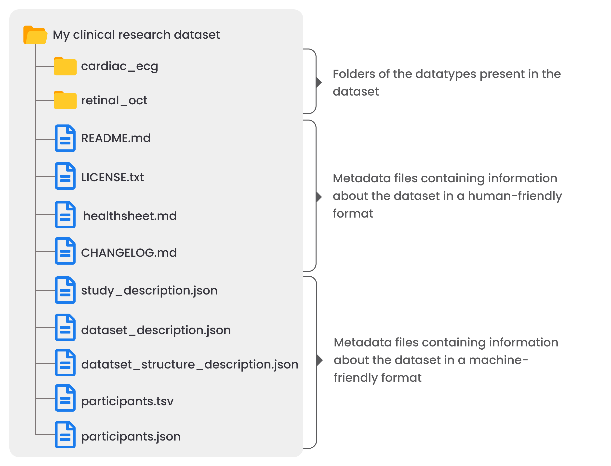

<div align="center">


<br />

<h1>Clinical Dataset Structure (CDS)</h1>

<p>
Documentation of the CDS, a standardized high-level data and metadata structure for creating interoperable and reusable clinical research datasets.
</p>

  <h4>
    <a href="https://cds-specification.readthedocs.io/en/v0.1.0/">cds-specification.readthedocs.io</a>
  </h4>
  
<br />

<p>
  <a href="https://github.com/AI-READI/cds-specification/graphs/contributors">
    
  </a>
  <a href="https://github.com/AI-READI/cds-specification/stargazers">
    
  </a>
  <a href="https://github.com/AI-READI/cds-specification/issues/">
    
  </a>
  <a href="https://github.com/AI-READI/cds-specification/blob/main/LICENSE">
    
  </a>
</p>
   
<h4>
    <a href="https://github.com/AI-READI/cds-template/issues/">Report Issues/Make suggestions</a>
  </h4>
</div>

<br />

---

## About

The Clinical Dataset Structure (CDS) is a simple and intuitive standard for the high-level organization of clinical research data and metadata. The CDS is designed to facilitate reusability of the dataset by humans and machines by making it intuitive to navigate and exposing information they may need when looking at the dataset. You can find everything about the CDS in [its documentation](https://cds-specification.vercel.app/) that is maintained from this repository.

<div align="center">
    
    <p><i> Illustration of a dataset with two datatypes (electrocardiogram and optical coherence tomography) structured following the CDS. </i></p>
</div>

## Contributing

<a href="https://github.com/AI-READI/cds-specification/graphs/contributors">
  
</a>

### Providing feedback/suggestions

Have feedback, suggestions, or questions related to the CDS? Submit them by opening a [GitHub issue](https://github.com/AI-READI/cds-specification/issues). If you want to suggest changes to the CDS documentation, you can also submit a PR by following the instructions in the developer instructions (see next section).

### Developer instructions

Instructions for making changes to the CDS documentation, submitting a PR, and publishing a new version of the documentation and guidelines are available [here](/dev/README.md).

## License

This work is licensed under
[MIT](https://opensource.org/licenses/mit). See [LICENSE](https://github.com/AI-READI/pyfairdatatools/blob/main/LICENSE) for more information.

## How to cite

If you are using the CDS or any of the associated effort, please cite:

```bash
    Coming soon
```

## Acknowledgements

This project is funded by the NIH under award number 1OT2OD032644. The content is solely the responsibility of the authors and does not necessarily represent the official views of the NIH.

<br />

---

<br />

<div align="center">

<a href="https://aireadi.org">
  
</a>

</div>
