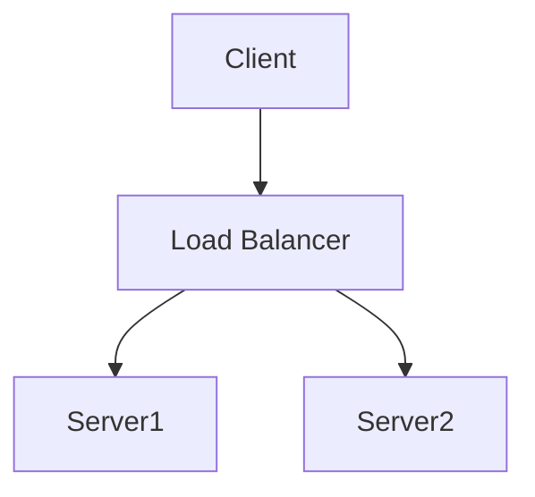
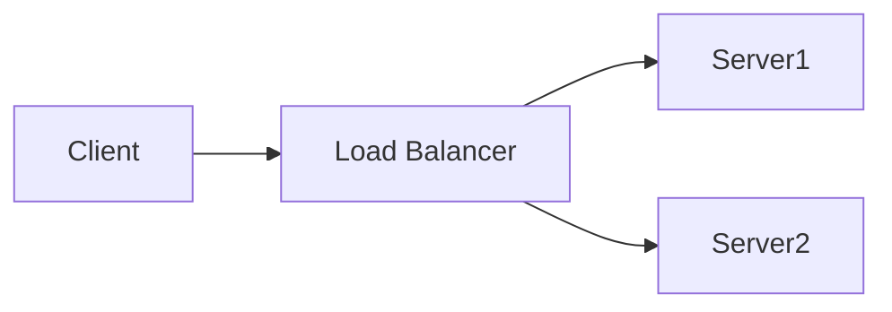
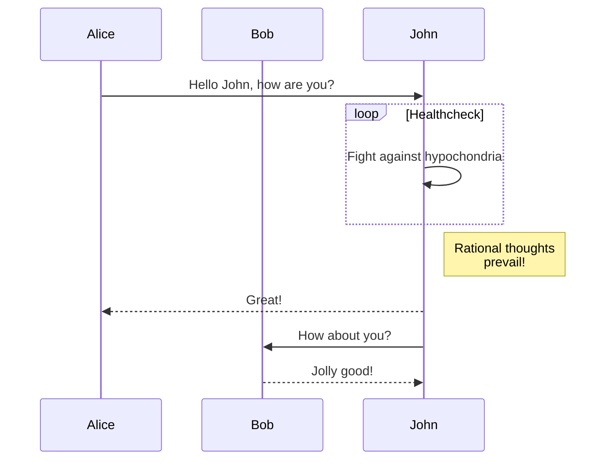
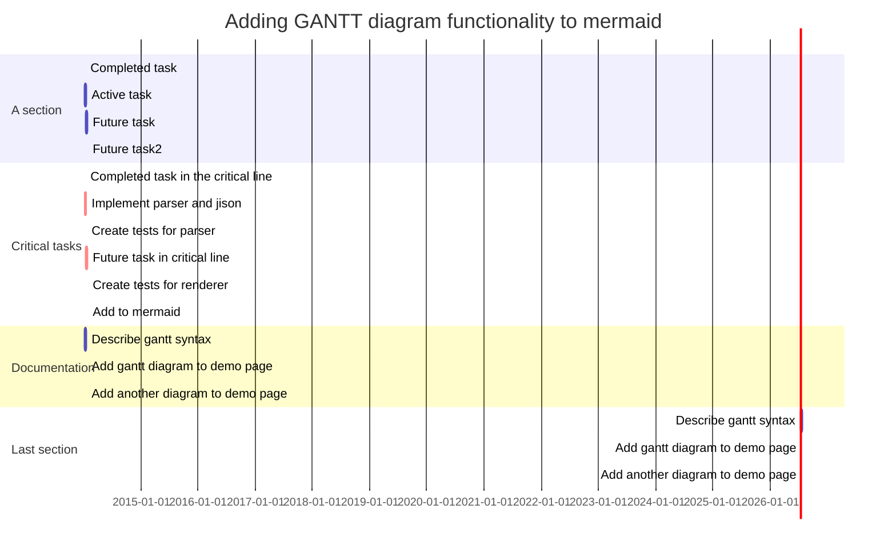

# Mermaid diagrams

Mermaid diagrams are a way to create diagrams using markdown syntax. This is a great way to create diagrams that are easy to maintain and can be used in multiple places. This is especially useful for diagrams that are used in multiple places.

## How to use

To use mermaid diagrams, you can use the following syntax:

````markdown

````

This will render the following diagram:


## Examples

### Flowchart



### Sequence diagram



### Gantt diagram


